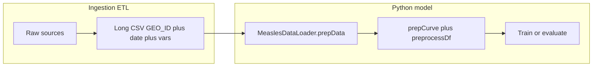

# Model input schema (ingestion output contract)

This document defines the **model-ready tabular dataset** that the Python training code expects after data ingestion. It is the contract between the ingestion layer (for example the R scripts under `data_ingestion_pipeline/`) and [`MeaslesDataLoader.prepData`](../model/MeaslesDataLoader.py).

The goal is to make it straightforward to plug in **other pathogens or data sources**: produce a CSV that matches this shape and column naming (or rename in a thin ETL step), align preprocessor rules, then run fitting with your chosen `depVar` and `indepVars`.

---

## 1. Purpose and data flow

1. **Ingestion** produces one long-format table: one row per geography per time period (monthly in the measles stack).
2. **Python** loads that CSV (default path: [`model/input/processed_measles_model_data.csv`](../model/input/processed_measles_model_data.csv)), splits by **`GEO_ID`**, renames `date` → `ds`, and builds per-country curves.
3. **Preprocessor + model** operate on each curve: see [`MeaslesModelEval.prepCurve`](../model/MeaslesModelEval.py) and [`EpiPreprocessor.preprocessDf`](../model/EpiPreprocessor.py).

For a visual boundary:



---

## 2. Required structural columns

These must be present in the ingested CSV for the **current** loader and curve builder to work.

| Column | Type / format | Role |
|--------|----------------|------|
| **`GEO_ID`** | String | Geography key; used for grouping, filters, and curve identity. Values are typically ISO 3166-1 alpha-3 codes (e.g. `NGA`). Renamed from **`ISO3`** at export in [`7_combine_all_datasets.R`](7_combine_all_datasets.R). |
| **`date`** | Parseable date (monthly `MS` recommended) | Timeline; renamed to **`ds`** inside Python. Rows should be sorted by date within each `GEO_ID`. |

No other column is *universally* required at ingestion time for the loader itself; everything else depends on your experiment (dependent variable and predictors).

---

## 3. Columns required to **run model fitting** (per experiment)

Fitting is configured with:

- **`depVar`**: outcome column name (often `cases_1M` in this repository; not hardcoded globally—see §6).
- **`indepVars`**: dictionary of predictor column names → lag (months).

From [`prepCurve`](../model/MeaslesModelEval.py):

1. **`depVar`** must exist and have enough non-missing values **before** preprocessing: more than `max(testSize, minAcceptableTotalMonths)` where `minAcceptableTotalMonths = 12` and `testSize` is derived from the train/test split or from a per-country cutoff.
2. After preprocessing, lag shifts, and `dropna()`, the curve must still have more than `max(min(testStatsWindow, testSize) * 2, 12)` rows (defaults in [`MeaslesModelEval.py`](../model/MeaslesModelEval.py)).
3. If you use per-country cutoffs in [`model/input/cutoff_date_by_country.csv`](../model/input/cutoff_date_by_country.csv), the number of rows **on or after** the cutoff must be at least **`minAcceptableTestMonths` (6)** or `setCutoffSize` raises.
4. Each predictor in **`indepVars`** must appear as a column with **at least one non-null** value for that country, or it is dropped for that curve. Across countries, missing columns are handled via `missingVarResponse` (`drop country`, `drop var`, or `ignore`) in [`pareIndepVars`](../model/MeaslesModelEval.py).

**Preprocessor alignment:** Any column that passes into `preprocessDf` should have a matching row in [`model/input/PreprocessorConfig.csv`](../model/input/PreprocessorConfig.csv) (or the Google Sheet URL your run uses). Ingestion should use those **exact** column names, or you must rename before writing the model CSV. Human-readable descriptions live in [`model/input/input_variable_description.csv`](../model/input/input_variable_description.csv).

---

## 4. Global-local (pooled) multi-geography models

“Global-local” here means **one model fit on time series stacked across multiple geographies**, with geography-specific structure learned from the data (not separate one-country models).

### 4.1 How countries enter the pool (`selection`)

[`initModel`](../model/MeaslesModelEval.py) resolves which geography codes to include from:

```text
preppedCountries['filters'][selection]
```

That `filters` dict is built in [`prepFilters`](../model/MeaslesDataLoader.py) when `prepData()` runs. Besides `'all'` (every country with a curve) and one key per geography (e.g. `'NGA'`), the loader adds **compound keys** for any CSV column that satisfies **both**:

1. **Between 2 and 11 unique values** in the full table (`df.nunique()`), and  
2. **At most one distinct value per `GEO_ID`** (`df.groupby('GEO_ID').nunique().max() == 1` for that column).

For each qualifying column (commonly **`cluster`**) and each level `k`, a key **`'{column}:{k}'`** maps to the list of `GEO_ID` values that share that level. Example: `cluster:1` → all countries in cluster 1.

**Ingestion implication:** To use pooled runs with **`selection='cluster:…'`** (or similar), the combined CSV must include a column such as **`cluster`** (or another stable per-country label) that meets the rules above. If no column qualifies, only `'all'` and per-`GEO_ID` keys are available.

### 4.2 Synthetic `ID` (not an ingested column)

After per-country train windows are prepared, [`mergeCurves`](../model/MeaslesModelEval.py) concatenates each country’s future/training frame and sets:

```python
countryCurve.loc[:, 'ID'] = country   # GEO_ID string
```

So **`ID` is assigned at runtime** from the country code; you do **not** need a column named `ID` in the ingested CSV. It is the grouping key for encoding (below).

### 4.3 Scikit-learn pooled models (country one-hot “global-local”)

When **`simObject.multipleCurves`** is true and the method is **not** `'NeuralProphet lagged regressors'`, [`mergeCurves`](../model/MeaslesModelEval.py) calls [`encodeMergedDf`](../model/EpiPreprocessor.py) with **`encoderAlignment = simObject.method`** (the full method string, e.g. `Scikit-learn generic: XGBRegressor`).

[`PreprocessorConfig.csv`](../model/input/PreprocessorConfig.csv) must contain a row whose **first column (Attribute)** matches that method string exactly, with **`encode_onehot_on_ID`** in the Methods column (see the existing rows for Scikit-learn methods). That produces **one-hot dummy columns for `ID`** (per-country indicators). Those new columns are appended to **`indepVars`** with lag `0` and become part of **`varKeys`** used in `model.fit(xTrain, yTrain)`.

**What you need for this path**

| Layer | Requirement |
|--------|----------------|
| **Ingested data** | Same as §3 for every country in the pool: `depVar`, all `indepVars`, preprocessor coverage. |
| **Selection** | A valid `selection` key (`'all'`, a `GEO_ID` value, or a generated `'column:value'` key). |
| **Preprocessor config** | Rows for all transformed predictors **plus** a row for your **exact** `method` string with `encode_onehot_on_ID`. |
| **Across countries** | With default `missingVarResponse='drop country'`, every country must have every required predictor column; otherwise use `'drop var'` / `'ignore'` and accept intersection of variables (see [`pareIndepVars`](../model/MeaslesModelEval.py)). |

The training matrix is built from [`mergedFutures.dropna(subset=['y'])`](../model/MeaslesModelEval.py): rows with missing `y` are dropped before fitting.

### 4.4 NeuralProphet lagged regressors (trend global / season local)

For [`npLaggedTTS`](../model/MeaslesModelEval.py), when **`multipleCurves`** is true, `NeuralProphet` is constructed with:

```python
trend_global_local="global"
season_global_local="local"
```

Here “global-local” is implemented **inside NeuralProphet** (shared trend, geography-specific seasonality), not via sklearn one-hot `ID`. [`mergeCurves`](../model/MeaslesModelEval.py) still sets **`ID`** on each row for splitting forecasts in [`processResults`](../model/MeaslesModelEval.py), but encoding is **`pass_unchanged`** for this method (no `encode_onehot_on_ID` step).

**Preprocessor:** The `NeuralProphet lagged regressors` row in `PreprocessorConfig.csv` should use **`pass_unchanged`** (or equivalent) for the encoder slot, not `encode_onehot_on_ID`.

### 4.5 Summary table

| Model style | `multipleCurves` | Extra columns from ingestion | Config / code |
|-------------|------------------|-------------------------------|---------------|
| Single country | `False` | No extra grouping column unless you use filters | `selection` = geography code (e.g. `NGA`) |
| Pooled sklearn | `True` | Optional **`cluster`** (or similar) for `selection='cluster:k'` | Method row + `encode_onehot_on_ID`; `ID` added in Python |
| Pooled NeuralProphet lagged | `True` | Same as sklearn for **selection**; predictors as usual | `trend_global_local` / `season_global_local`; no ID one-hot |

---

## 5. Strongly recommended: `cases_1M` (measles stack coupling)

[`MeaslesDataLoader.py`](../model/MeaslesDataLoader.py) sets:

```python
validityColumn = 'cases_1M'
```

Each country curve is **truncated at the last row where `cases_1M` is non-null**, regardless of which column you pass as `depVar`. For a new disease:

- **Option A (no code change):** Provide a column still named **`cases_1M`** with the same role (incidence per million or your chosen scale), or  
- **Option B:** Change `validityColumn` in the loader to your outcome or a dedicated “series end” column.

Country **ordering** in `prepCountries` uses `num_outbreak_20_cuml_per_M` if present, otherwise **`cases_1M.max()`** per country (affects ordering only, not minimum column set).

---

## 6. Optional columns (measles pipeline)

Examples present in the reference dataset (see [`model/input/example_minimal_model_input.csv`](../model/input/example_minimal_model_input.csv) for the full header row):

- **Labels / metadata:** `Country`, `Region`, `Year`, `Month`, `char_date`, `unicef_region`, `cluster`, `cluster_region`, `cluster_redraw`, …
- **Case and outbreak features:** `cases`, `cuml_cases`, outbreak indicators, rolling features, etc.
- **Merged predictors:** climate, World Bank-style series, vaccination, policy strings, roads, SIA, travel, etc.

These are only “required” if they appear in your **`indepVars`** or **`depVar`** for a given run.

---

## 7. `depVar` vs `cases_1M`

- **`depVar`** is chosen when you construct the model (for example in notebooks or metadata); it is **not** fixed to `cases_1M` in `initModel` / `prepCurve`.
- **`cases_1M`** is still used for **curve truncation** via `validityColumn` unless you change the loader (§5).

---

## 8. R script 7 vs Python default path

[`7_combine_all_datasets.R`](7_combine_all_datasets.R) merges interim datasets on **`ISO3`**, then renames **`ISO3` → `GEO_ID`** immediately before writing **`model_training_data.csv`** at the **repository root**. The Python loader expects **`model/input/processed_measles_model_data.csv`** by default (with column **`GEO_ID`**).

**Action:** After running script 7, copy or symlink the combined CSV to the path your Python run uses, or change `defaultLoc` in `prepData()` to match your export.

---

## 9. Optional: cutoff file

**File:** [`model/input/cutoff_date_by_country.csv`](../model/input/cutoff_date_by_country.csv) (configurable in `prepData`).

**Expected:** At least **`ISO3`** and a date column (default name **`cutoff_date`**). Cutoff files keep **`ISO3`**; keys are matched to curve **`GEO_ID`** values (same codes). If the file is missing, cutoffs may fall back to `'not passed'` depending on `prepData` behavior.

---

## 10. Machine-readable schema

A JSON Schema draft-07 document with required **`GEO_ID`** and **`date`** is at [`schemas/model_input.schema.json`](schemas/model_input.schema.json). Additional predictor properties are intentionally open (`additionalProperties: true`) because studies differ.

---

## 11. Checklist: new pathogen or new dataset

1. **Long table:** **`GEO_ID`** + `date` + one row per period per geography.  
2. **Outcome:** Column for `depVar`; decide handling of **`cases_1M`** / `validityColumn` (§5).  
3. **Predictors:** Columns match names in `indepVars` and in `PreprocessorConfig.csv` (add rows for new variables).  
4. **Pooled runs:** If using `selection` like `cluster:k`, add a qualifying grouping column (§4.1); for sklearn pooled fits, ensure the **method** row exists with **`encode_onehot_on_ID`** (§4.3).  
5. **Document** new columns in `input_variable_description.csv` (recommended for reproducibility).  
6. **Export path:** Align combined CSV with `MeaslesDataLoader.prepData` `defaultLoc` (§8).  
7. **Cutoffs:** Provide `cutoff_date_by_country.csv` if you use dated validation.  
8. **Run:** Configure `depVar`, `indepVars`, `selection`, and preprocessor URL/path in your notebook or driver script.

---

## References (code)

| Topic | File |
|-------|------|
| Load CSV, merge optional trends, cutoffs, filters | [`model/MeaslesDataLoader.py`](../model/MeaslesDataLoader.py) |
| Per-country curve, `date` → `ds`, truncation | `getCountryCurve`, `prepCountries` |
| Fitting thresholds, preprocessor, train/test | [`model/MeaslesModelEval.py`](../model/MeaslesModelEval.py) `prepCurve`, `setCutoffSize`, `pareIndepVars` |
| Pooled merge, encoding, `varKeys` | `mergeCurves`, `getMergedFutures`, `initModel` |
| Column-wise transforms | [`model/EpiPreprocessor.py`](../model/EpiPreprocessor.py), [`model/input/PreprocessorConfig.csv`](../model/input/PreprocessorConfig.csv) |
| Batch run CSV metadata (`fitOne`, `ROW_ID`, `model`, lags) | [`model/METADATA_RUN_SCHEMA.md`](../model/METADATA_RUN_SCHEMA.md), [`model/fitOne.py`](../model/fitOne.py) |
