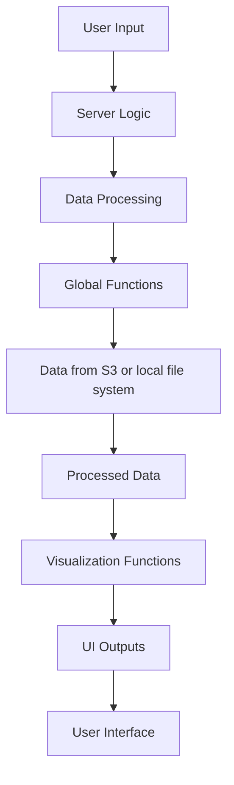

```{r setup, include=FALSE}
knitr::opts_chunk$set(echo = TRUE, warning = FALSE, message = FALSE)
library(knitr)
library(DT)
```

# Overview

The **Measles Model Validation Shiny Application** is a comprehensive web-based tool designed to visualize and analyze measles model selection and validation results. This application allows users to explore model performance metrics, compare epidemiological predictions with observed data, and evaluate model performance across different countries and time periods.

## Key Features

- **Interactive Country Selection**: Choose from a comprehensive list of countries with ISO3 codes
- **Model Performance Metrics**: View detailed performance statistics in an interactive data table
- **Epidemiological Curve Visualization**: Compare observed vs predicted case counts over time
- **Binary Outcome Analysis**: Visualize outbreak prediction accuracy using heatmaps
- **Model Selection & Validation**: Separate analysis periods for model training and validation
- **Customizable Parameters**: Adjust the number of top models to display and ranking criteria

---

# User Documentation

## Getting Started

### Prerequisites

Before running the application, ensure you have the following R packages installed:

```{r packages, eval=FALSE}
# Required packages
install.packages(c("shiny", "data.table", "plotly", "ggplot2", "DT", "viridis", "countrycode", "lubridate", "htmltools", "fontawesome"))
```

### Running the Application

1. **Load the application files** in your R environment:
   - `global.R` - Global variables and functions
   - `ui.R` - User interface definition
   - `server.R` - Server-side logic

2. **Run the Shiny app**:
   ```r
   shinyApp(ui = ui, server = server)
   ```

3. **Access the application** through your web browser at the provided URL (typically `http://127.0.0.1:XXXX`)

## User Interface Guide

### Navigation

The application features a clean, responsive interface with:

- **Top Navigation Bar**: Contains the application title and branding
- **Left Sidebar**: Country selection and parameter controls
- **Main Content Area**: Interactive visualizations and data tables

### Country Selection

1. **Select Country**: Use the dropdown menu in the left sidebar to choose a country
   - Countries are listed with both ISO3 codes and full names (e.g., "AFG - Afghanistan")
   - Default selection is Afghanistan (AFG)

### Parameter Controls

2. **First n**: Specify how many top-performing models to display (1-100)
   - Default: 5 models
   - Controls the number of models shown in all visualizations

3. **Order by**: Choose the performance metric for ranking models
   - Available metrics: Combine_RMSE5, Combine_MSE5, Combine_MAE5, Test_MSE, Test_MAE, Train_MSE, Train_MAE
   - Default: Test_MSE (lower values indicate better performance)
   - Note: R² metrics are excluded as higher values indicate better performance

### Data Visualization

#### Model Performance Table

The **Model Evaluation** table displays:
- Model identification information (ID, MODEL_ID, country, predictor, model type)
- Prediction tier classifications
- Performance metrics (RMSE, MSE, MAE, R²) for both training and testing phases
- Models are automatically sorted by the selected ranking criteria

#### Epidemiological Curves

**Model Selection Period**:
- Shows observed measles cases (black line) vs model predictions (colored lines)
- Each model is represented by a different color using the viridis palette
- Solid lines indicate individual model runs, dashed lines indicate cluster runs
- Red vertical lines mark the cutoff and end dates for the evaluation period

**Model Validation Period**:
- Similar visualization for validation data (if available)
- Shows how well models perform on unseen data
- Displays "No validation runs present" message if validation data is unavailable

#### Binary Outcome Heatmaps

**Model Selection & Validation**:
- Heatmap visualization comparing predicted vs observed outbreak classifications
- Uses a 5M case threshold to define outbreaks
- Blue tiles: No outbreak predicted/observed
- Green tiles: Outbreak predicted/observed
- Red vertical lines indicate evaluation period boundaries
- Models are ordered by performance rank (best at top)

## Understanding the Results

### Performance Metrics

- **RMSE (Root Mean Square Error)**: Lower values indicate better prediction accuracy
- **MSE (Mean Square Error)**: Average squared differences between predicted and observed values
- **MAE (Mean Absolute Error)**: Average absolute differences between predictions and observations
- **R² (R-squared)**: Proportion of variance explained by the model (higher is better)

### Model Types

- **S-**: Standard model runs
- **E-**: Ensemble models (boosted heavy, diverse configurations)

### Time Periods

- **Selection Period**: Used for model training and initial evaluation
- **Validation Period**: Independent test period to assess model generalization

---

# Technical Documentation

## Application Architecture

The application follows the standard Shiny architecture with three main components:

### 1. Global Script (`global.R`)

**Purpose**: Contains global variables, data loading, and utility functions shared across the application.

#### Key Components:

**Data Loading**:
```r
# Loads model performance summary from S3 or the file system
summaryTable <- fread(cmd = paste0("aws s3 cp --profile internal s3://..."))

# Processes numeric columns and rounds to 3 decimal places
summaryTable[, (num_cols) := lapply(.SD, as.numeric), .SDcols = num_cols]
summaryTable[, (num_cols) := lapply(.SD, function(x) round(x, 3)), .SDcols = num_cols]
```

**Utility Functions**:
- `get_plot_dat()`: Retrieves and processes time series data for visualization
- `plot_binary_outcome()`: Creates heatmap visualizations for binary outcomes

#### Dependencies:
- `shiny`: Web application framework
- `data.table`: Fast data manipulation
- `plotly`: Interactive plotting
- `ggplot2`: Static plotting
- `DT`: Data tables
- `viridis`: Color palettes
- `countrycode`: Country name conversion
- `lubridate`: Date manipulation

### 2. User Interface (`ui.R`)

**Purpose**: Defines the HTML structure and user interface components.

#### Key Components:

**HTML Dependencies**:
```r
# Bootstrap 4.3.1 for responsive layout
bootstrapDep <- htmltools::htmlDependency("bootstrap", "4.3.1", ...)

# Popper.js for Bootstrap dropdown functionality
popperDep <- htmltools::htmlDependency("popper", "1.14.7", ...)

# jQuery for JavaScript functionality
jQueryDep <- htmltools::htmlDependency("jquery", "3.3.1", ...)

# Font Awesome for icons
fontAwesomeDep <- htmltools::tagList(fontawesome::fa_html_dependency())
```

**UI Structure**:
- **Navigation Bar**: Company branding and application title
- **Sidebar Panel**: Country selection and parameter controls
- **Main Panel**: Data table and visualization outputs

#### Output Elements:
- `dataTableOutput("model_evaluation_table")`: Performance metrics table
- `plotlyOutput("epi_curves")`: Epidemiological curves (selection)
- `plotlyOutput("binary_outcome_plots")`: Binary outcome heatmap (selection)
- `plotlyOutput("epi_curves_validation")`: Epidemiological curves (validation)
- `plotlyOutput("binary_outcome_plots_validation")`: Binary outcome heatmap (validation)

### 3. Server Logic (`server.R`)

**Purpose**: Handles reactive data processing and output generation.

#### Key Functions:

**Data Processing**:
```r
# Gets top N models based on user selection
n_to_take <- min(input$top_n, nrow(summaryTable[ID == COUNTRY,]))
top_iso3_plot_dat <- get_plot_dat(summ_dt = summaryTable, cutoff_dat = cutoff_dat,
                                  iso3 = COUNTRY, col_name = input$order_summary_col_by, 
                                  n = n_to_take, by_config = "yes")
```

**Output Rendering**:
- `output$model_evaluation_table`: Renders performance metrics table
- `output$epi_curves`: Creates epidemiological curve plots
- `output$binary_outcome_plots`: Generates binary outcome heatmaps
- `output$epi_curves_validation`: Renders validation period curves
- `output$binary_outcome_plots_validation`: Creates validation period heatmaps

## Data Flow



## Configuration

### S3 Data Sources

The application loads data from AWS S3 or file system with the following structure: For example:
```
s3://metabiota-modeling-internal/BMGF_measles/
├── shiny_final_model/
│   ├── model_selection/
│   │   ├── summaryTable.csv
│   │   └── country_output/
│   │       └── {ISO3}.csv
│   └── model_validation/
│       └── country_output/
│           └── {ISO3}.csv
└── model_input/
    └── final_model_validation_cutoffs.csv
    
shiny_standalone
├── data/tables
│   ├── selection/
│   │   ├── summaryTable.csv
│   │   └── country_output/
│   │       └── {ISO3}.csv
│   └── validation/
│       └── country_output/
│           └── {ISO3}.csv
└── data/
    └── sample_summaryTable.csv
    └── cutoff_date_by_country.csv
```

### Environment Variables

Ensure the following AWS credentials are configured:
- AWS profile: `internal`
- S3 bucket access permissions
- Appropriate IAM roles for data access
- Or file system access

## Performance Considerations

### Data Loading
- Data is loaded once at application startup
- S3 or file system data retrieval is cached in memory
- Large datasets are processed efficiently using `data.table`

### Reactive Updates
- Only necessary computations are performed when inputs change
- Plot rendering is optimized for interactive performance
- Data filtering occurs before visualization generation

### Memory Management
- Unused reactive functions have been removed
- Data processing is streamlined to minimize memory usage
- Large datasets are subset before visualization

## Error Handling

### Data Availability
- Graceful handling of missing validation data
- Informative messages when no data is available
- Fallback visualizations for empty datasets

### Input Validation
- Numeric input bounds checking (1-100 for top_n)
- Country selection validation
- Performance metric selection validation

## Customization

### Adding New Performance Metrics
1. Add metric names to `num_cols` vector in `global.R`
2. Update UI choices in `ui.R`
3. Ensure data processing handles new columns

### Modifying Visualizations
1. Update plotting functions in `global.R`
2. Modify server output functions in `server.R`
3. Adjust UI output elements as needed

### Styling Changes
1. Modify CSS in `ui.R`
2. Update Bootstrap classes and custom styles
3. Adjust color schemes and fonts as needed

---

# Troubleshooting

## Common Issues

### Data Loading Errors
- **Issue**: "No validation runs present for this country"
- **Solution**: This is expected behavior for countries without validation data

### Performance Issues
- **Issue**: Slow loading or rendering
- **Solution**: Reduce the number of models displayed (lower "First n" value)

### Missing Dependencies
- **Issue**: Application fails to start
- **Solution**: Ensure all required packages are installed and up to date

## Support

For technical support or questions about the application:
- Check the console output for error messages
- Verify data availability
- Ensure all dependencies are properly installed

---

# Version History

- **v1.0**: Initial release with core functionality
  - Model performance visualization
  - Epidemiological curve plotting
  - Binary outcome analysis
  - Country selection and parameter controls

---

*This documentation was generated on `r Sys.Date()` for the Measles Model Validation Shiny Application.*
